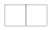
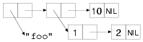

# "There Is No List"（“没有列表”）

> Spoon Boy: Do not try and bend the list. That's
> impossible. Instead... only try to realize the truth.

> 勺子男孩：不要试图弯曲列表。那是不可能的。相反，只要尽量认识真相就好。

> Neo: What truth?

> 尼奥：什么真相？

> Spoon Boy: There is no list.

> 勺子男孩：没有列表。

> Neo: There is no list?

> 尼奥：没有列表？

> Spoon Boy: Then you'll see that it is not the list that bends; it is
> only yourself.

> 勺子男孩：然后你将看到弯曲的不是列表，而只是你自己。

The key to understanding lists is to understand that they're largely
an illusion built on top of objects that are instances of a more
primitive data type. Those simpler objects are pairs of values called
cons cells, after the function **CONS** used to create them.

理解列表的关键在于认识到它们在很大程度上是一种构建在更基本数据类型实例对象之上的描述。那些更简单的对象是称为点对单元（cons
cell）的成对的值，使用函数 **CONS** 可以创建它们。

**CONS** takes two arguments and returns a new cons cell containing the
two values. These values can be references to any kind of
object. Unless the second value is **NIL** or another cons cell, a cons is
printed as the two values in parentheses separated by a dot, a
so-called *dotted pair*.

**CONS**
接受两个实参并返回一个含有两个值的新点对单元。 这些值可以是对任何类型对象的引用。除非第二个值是
**NIL** 或是另一个点对单元，否则点对都将被打印成在括号中用一个点分隔两个值的形式，即所谓的“点对”（dotted pair）。

```lisp
(cons 1 2) ==> (1 . 2)
```

The two values in a cons cell are called the **CAR** and the **CDR** after the
names of the functions used to access them. At the dawn of time, these
names were mnemonic, at least to the folks implementing the first Lisp
on an IBM 704. But even then they were just lifted from the assembly
mnemonics used to implement the operations. However, it's not all bad
that these names are somewhat meaningless--when considering individual
cons cells, it's best to think of them simply as an arbitrary pair of
values without any particular semantics. Thus:

一个点对单元中的两个值分别被称为 **CAR** 和
**CDR**，它们同时也是用来访问这两个值的函数名。在它们刚出现的年代，这些名字是有意义的，至少对于那些在
IBM 704 计算机上最早实现 Lisp
的人们来说是这样的。但即便在那时，它们也只被看作是用来实现这些操作的汇编助记符。但这些名字稍显缺乏意义也并不是件很坏的事情。当考虑单独的点对单元时，最好将它们想象成是简单的没有任何特别语义的任意数。因此：

```lisp
(car (cons 1 2)) ==> 1
(cdr (cons 1 2)) ==> 2
```

Both **CAR** and **CDR** are also **SETF**able places--given an existing cons
cell, it's possible to assign a new value to either of its values.

**CAR** 和 **CDR** 也都是能够支持 **SETF**
的位置，即给定一个已有的点对单元，有可能会将新的值赋给它的任何一个值。

```lisp
(defparameter *cons* (cons 1 2))
*cons*                 ==> (1 . 2)
(setf (car *cons*) 10) ==> 10
*cons*                 ==> (10 . 2)
(setf (cdr *cons*) 20) ==> 20
*cons*                 ==> (10 . 20)
```

Because the values in a cons cell can be references to any kind of
object, you can build larger structures out of cons cells by linking
them together. Lists are built by linking together cons cells in a
chain. The elements of the list are held in the **CAR**s of the cons cells
while the links to subsequent cons cells are held in the **CDR**s. The
last cell in the chain has a **CDR** of **NIL**, which--as I mentioned in
Chapter 4--represents the empty list as well as the boolean value
false.

由于点对中的值可以是对任何类型对象的引用，因此可以通过将点对连接在一起
而用它们构造出更大型的结构。列表是通过将点对以链状连接在一起而构成的。
列表的元素被保存在点对的
**CAR** 中而对后续点对的链接则被保存在 **CDR**
中。链上最后一个单元的 **CDR** 为
**NIL**，正如第4章所提到的那样，它同时代表空列表和布尔值假。

This arrangement is by no means unique to Lisp; it's called a singly
linked list. However, few languages outside the Lisp family provide
such extensive support for this humble data type.

这一安排毫无疑问是 Lisp
所独有的，它被称为一个单链表。不过，很少有 **Lisp**
家族之外的语言会对这种低微的数据类型提供如此广泛的支持。

So when I say a particular value is a list, what I really mean is it's
either **NIL** or a reference to a cons cell. The **CAR** of the cons cell is
the first item of the list, and the **CDR** is a reference to another
list, that is, another cons cell or **NIL**, containing the remaining
elements. The Lisp printer understands this convention and prints such
chains of cons cells as parenthesized lists rather than as dotted
pairs.

因此当我讲一个特定的值是一个列表时，其实真正的意思是说它要么是 **NIL**
要么是对一个点对单元的引用。该点对单元的CAR就是该列表的第一个元素，而 **CDR**
则是包含着其余元素，它引用着其他的列表，这有可能是另一个点对单元或
**NIL**。Lisp
打印器可以理解这种约定并能将这种链状的点对单元打印成括号列表而不是用点分隔的数对。

```lisp
(cons 1 nil)                   ==> (1)
(cons 1 (cons 2 nil))          ==> (1 2)
(cons 1 (cons 2 (cons 3 nil))) ==> (1 2 3)
```

When talking about structures built out of cons cells, a few diagrams
can be a big help. Box-and-arrow diagrams represent cons cells as a
pair of boxes like this:

当谈论构建在点对单元之上的结构时，一些图例可以很好地帮助我们来理解它们。方框和箭头所组成的图例可以像下面这样将点对单元表示成一对方框：



The box on the left represents the **CAR**, and the box on the right is
the **CDR**. The values stored in a particular cons cell are either drawn
in the appropriate box or represented by an arrow from the box to a
representation of the referenced value. For instance, the list
`(1 2 3)`, which consists of three cons cells linked together by their **CDR**s,
would be diagrammed like this:

左边的方框代表 **CAR**，而右边的则代表
**CDR**。保存在一个特定点对单元中的值要么被画在适当的方框之内，要么通过一个从方框指向其所引用值的箭头来表示。例如，列表
`(1 2 3)` 是由三个点对单元通过它们的 **CDR**
链接在一起所构成的，如下所示：


However, most of the time you work with lists you won't have to deal
with individual cons cells--the functions that create and manipulate
lists take care of that for you. For example, the **LIST** function builds
a cons cells under the covers for you and links them together; the
following **LIST** expressions are equivalent to the previous **CONS**
expressions:

尽管如此，一般在使用列表时并不需要处理单独的点对单元——创建和管理列表的函数将为你做这些事。例如，**LIST**
函数可以在背后为你构建一些点对单元并将它们链接在一起。下面的
**LIST** 表达式等价于前面的 **CONS** 表达式：

```lisp
(list 1)     ==> (1)
(list 1 2)   ==> (1 2)
(list 1 2 3) ==> (1 2 3)
```

Similarly, when you're thinking in terms of lists, you don't have to
use the meaningless names **CAR** and **CDR**; **FIRST** and **REST** are synonyms for
**CAR** and **CDR** that you should use when you're dealing with cons cells as
lists.

类似地，当从列表的角度考虑问题时，并不需要使用没有意义的名字 **CAR** 和
**CDR**，**FIRST** 和 **REST** 分别是 **CAR** 和 **CDR**
的同义词，当处理作为列表的点对时应该使用它们。

```lisp
(defparameter *list* (list 1 2 3 4))
(first *list*)        ==> 1
(rest *list*)         ==> (2 3 4)
(first (rest *list*)) ==> 2
```

Because cons cells can hold any kind of values, so can lists. And a
single list can hold objects of different types.

因为点对单元可以保存任何类型的值，所以它也可以保存列表。并且单一列表可以保存不同类型的对象。

```lisp
(list "foo" (list 1 2) 10) ==> ("foo" (1 2) 10)
```

The structure of that list would look like this:

该列表的结构将看起来像这样：



Because lists can have other lists as elements, you can also use them
to represent trees of arbitrary depth and complexity. As such, they
make excellent representations for any heterogeneous, hierarchical
data. Lisp-based XML processors, for instance, usually represent XML
documents internally as lists. Another obvious example of
tree-structured data is Lisp code itself. In Chapters 30 and 31 you'll
write an HTML generation library that uses lists of lists to represent
the HTML to be generated. I'll talk more next chapter about using cons
cells to represent other data structures.

由于列表可以将其他列表作为元素，因此可以用它们来表示任意深度与复杂度的
树。由此它们可以成为任何异构和层次数据的极佳表示方式。例如，基于
Lisp 的 XML 处理器通常在内部将 XML
文档表示成列表。另一个明显的树型结构数据的例子就是 Lisp
代码本身。第 30 和 31 章里我们将编写一个 HTML
生成库，其中使用列表的列表来表示被生成的
HTML。第 13 章里将介绍如何用点对来表示其他数据结构。

Common Lisp provides quite a large library of functions for
manipulating lists. In the sections "List-Manipulation Functions" and
"Mapping," you'll look at some of the more important of these
functions. However, they will be easier to understand in the context
of a few ideas borrowed from functional programming.

Common Lisp 为处理列表提供了一个相当大的函数库。在第 12.5
和 12.6 两节里将介绍一些更重要的这类函数。但利用取自函数式编程的一些观点来考虑，这些函数将更容易被理解。
